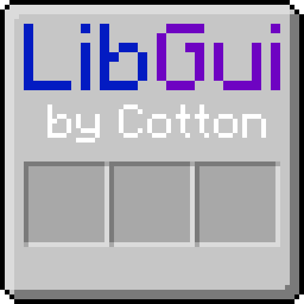

# LibGui

 

Minecraft GUIs without spending forever painstakingly aligning things to the background image.
Instead, LibGui takes a logical description of your GUI, and draws it on-the-fly like any modern
GUI system. Controls can be hung on an itemslot grid or offset from it. Panel styles, colors,
and opacity can be customized, and everything can be extended.

See the [LibGui wiki](https://github.com/CottonMC/LibGui/wiki) for setup

And for code examples:
* [Client-Only Guis](https://github.com/CottonMC/LibGui/wiki/Client-Sided-Guis) 
* [Inventory Guis](https://github.com/CottonMC/LibGui/wiki/Getting-Started-with-GUIs)

For an idea of what's coming down the road for all my projects, you can check my roadmap at https://trello.com/b/0TVU8d63/falkreons-roadmap
